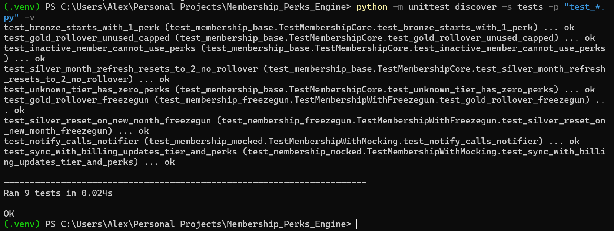

# Subscription Entitlements Engine


A **config-driven subscription entitlement engine** that models tier-based perks, automatic monthly refresh, rollover policies (with caps), and a testable architecture using dependency injection.

---

## What this project demonstrates

- **Domain modeling**: tier-based entitlements and business rules implemented in a clean, maintainable core.
- **Time-dependent logic done right**: a `Clock` abstraction enables deterministic testing of month boundaries and rollover behavior.
- **Boundary isolation**: external dependencies (billing sync, notifications) are tested via mocks (`unittest.mock`).
- **Production-style Python layout**: `src/` packaging + `pyproject.toml` for installable imports.

---

## Project structure

```
src/
  subscription_entitlements_engine/
    __init__.py
    membership.py
tests/
  test_membership_base.py
  test_membership_freezegun.py
  test_membership_mocked.py
pyproject.toml
requirements.txt
```

---

## Screenshot

> ✅ Test suite passing locally:



---

## Quickstart (Windows / PowerShell)

```powershell
python -m venv .venv
.\.venv\Scripts\Activate.ps1

pip install -r requirements.txt
pip install -e .
```

Run the test suite:

```powershell
python -m unittest discover -s tests -p "test_*.py" -v
```

---

## Testing strategy

This repository intentionally demonstrates three complementary testing approaches:

### 1. Deterministic business rule testing
- Uses a `FakeClock` abstraction to control time precisely.
- Validates tier rules, rollover caps, and month-boundary behavior.
- Ensures time-dependent logic is fully predictable.

### 2. Time simulation testing
- Uses `freezegun` to simulate real datetime transitions.
- Confirms monthly refresh logic works through public APIs.
- Avoids testing private methods directly.

### 3. Boundary isolation via mocking
- Uses `unittest.mock` to simulate billing providers and notification services.
- Verifies integration behavior without external dependencies.
- Demonstrates clean dependency injection.

---

## Design notes

- Business rules are configuration-driven rather than hard-coded conditionals.
- Monthly refresh logic is triggered automatically through public behavior.
- Private methods are not tested directly — behavior is validated through public interfaces.
- The `src/` layout ensures imports mirror production installs (`pip install -e .`).
- Time logic is isolated via dependency injection for testability.

---

## Continuous Integration

GitHub Actions runs the full test suite on:
- Every push
- Every pull request
- Multiple Python versions

This ensures the engine remains stable across environments.

---

## Possible future enhancements

- Add persistence layer (repository pattern with database backend)
- Add CLI interface for interactive usage
- Add REST API wrapper (FastAPI)
- Add coverage reporting
- Add linting and formatting checks in CI

---

## License

MIT License

---

## Author

**Alex Waddell**  
Software Development Intern — Creating Coding Careers  
BAS in Software Development — California Institute of Applied Technology  

Transitioning U.S. Army NCO → Software Engineer  

🔗 [LinkedIn](https://www.linkedin.com/in/alex-waddell-5082a429b)